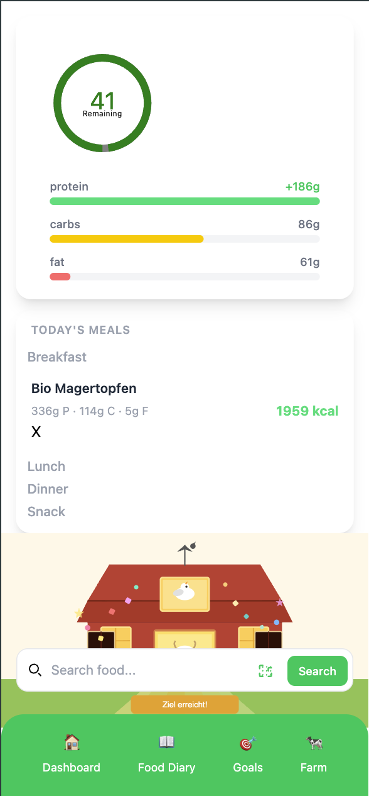
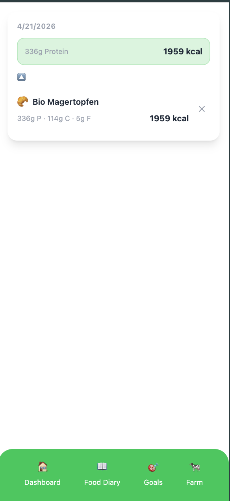
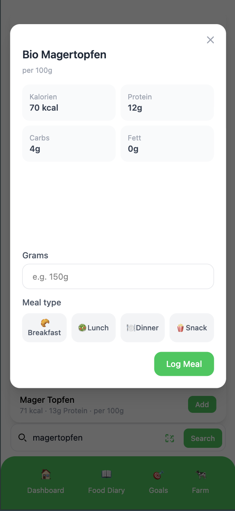
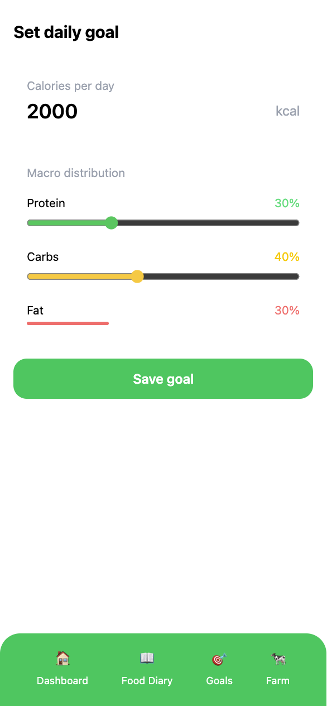
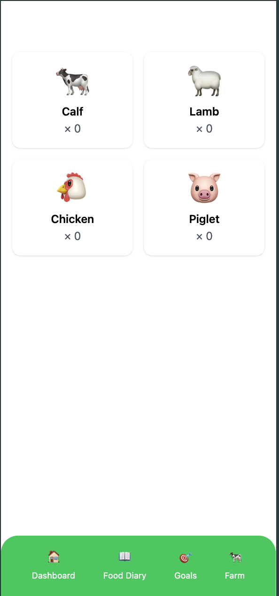

# veggieTracker

A mobile-first food tracking app for vegetarians. Log meals, track macros, and unlock farm animals by hitting your daily goals.

## Screenshots

| Dashboard | Food Diary | Add Meal |
|---|---|---|
|  |  |  |

| Goals | Farm |
|---|---|
|  |  |

## Features

- Track daily calories and macros (protein, carbs, fat)
- Search foods via Open Food Facts API
- Barcode scanner for quick product lookup
- Set custom macro goals with interactive sliders
- Farm gamification — unlock animals by reaching your daily goal
- Food diary with meal history

## Tech Stack

- **Vue 3** + Vite
- **Pinia** for state management
- **Tailwind CSS** for styling
- **Open Food Facts API** for food data
- **ZXing** for barcode scanning

## Run locally

```bash
npm install
npm run dev
```
